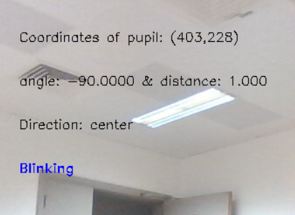
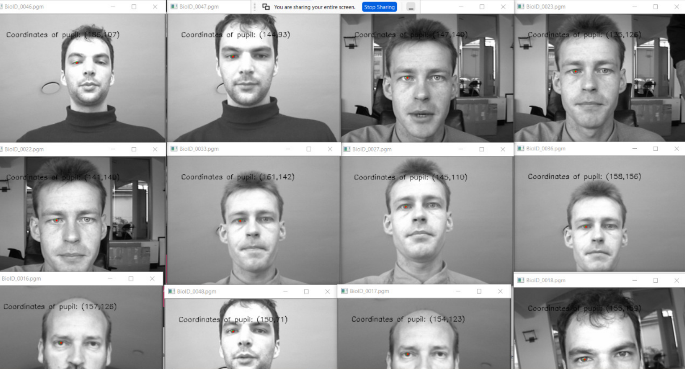
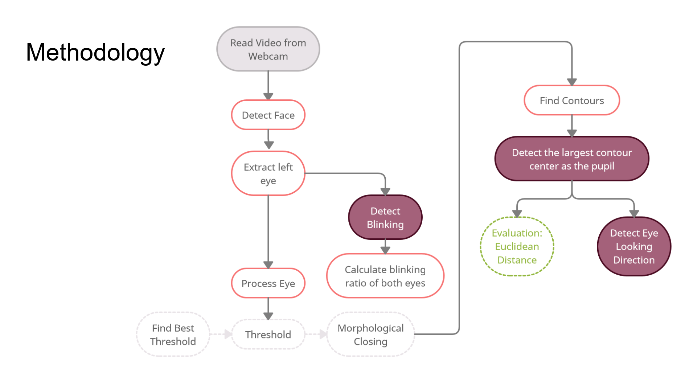
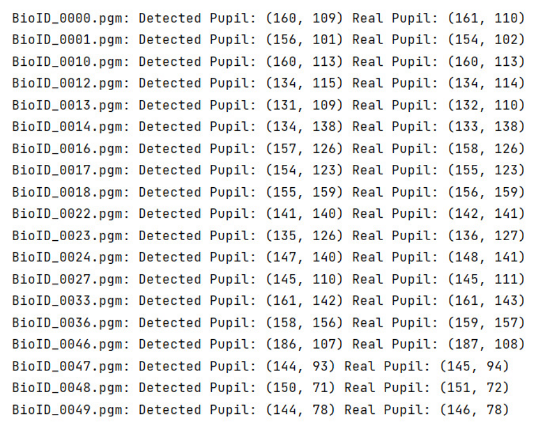

# Controlling Mouse Cursor through Gaze for Physically Disabled Individuals


## Table of contents

- [Overview](#overview)
  - [Problems solved](#the-solution-tries-to-solve-the-following-problems)
  - [Screenshot](#screenshot)
  - [Sample Run](#sample-run-for-evaluationpy-file)
  - [Links](#links)
  - [Dependencies](#dependencies)
- [Methodology](#methodology)
  - [Experiments](#experiments)
- [Limitations & Difficulties](#limitations--difficulties)
- [Future Work](#future-work)
- [Authors](#authors)


## Overview
Many disabilities affect person’s ability to use their hand or communicate.
We aim to provide a solution that Enables people with disabilities to use computers by controlling the mouse using gaze.


### The Solution tries to solve the following problems 
✔ Eye detection

✔ Blink detection

✔ Gaze direction

❌ Mouse Control
 
**The program provides real-time results for the above requirements.**

An example for the real-time output results is here:

### Screenshot


### Sample run for `evaluation.py` file




### Links

- Real-time file URL: [Main](https://github.com/inesriahi/EyeTracking/blob/master/main.py)
- Evaluation file URL: [Evaluation](https://github.com/inesriahi/EyeTracking/blob/master/evaluation.py)

### Dependencies
All the dependencies along with their corresponding version are given in [`requirments.txt`](https://github.com/inesriahi/EyeTracking/blob/master/requirements.txt) :
```
numpy==1.18.5
matplotlib==3.2.2
dlib==19.8.1
seaborn==0.11.1
opencv-python==4.3.0
```

## Methodology
- Eye detection
    - Dlib Library
- Image Processing
    - Thresholding
    - Morphological Operations: Closing
    - Find Contours 
    - Moments: to detect iris center as pupil
    - Pseudo-landmarks Calculation
- Blink detection
    - Calculate the ratio by between eye's horizontal and the vertical lines
- Gaze direction 
    - Calculate the angle and the distance between the pupil and eye center



### Experiments
For experiments, we have used the [BioID Face Database](https://www.bioid.com/facedb/):
> The BioID Face Database has been recorded and is published to give all researchers working in the area of face detection the possibility to compare the quality of their face detection algorithms with others. It may be used for such purposes without further permission. During the recording special emphasis has been placed on “real world” conditions. Therefore the testset features a large variety of illumination, background, and face size. Some typical sample images are shown below.
- Contains 1521 gray level images
- Resolution of 384×286
- Contains images with their corresponding eye positions.

We have provided 5 images in `test_imgs` directory for you to experiment the solution.

The following compares our solution's detected pupil's coordinates versus the real coordinates:


## Limitations & Difficulties
- The accuracy of eye center detection needs improvement
- Python computational limitations
- Working in different Light conditions
- The accuracy decreases when the user is wearing glasses
- The solution assumes that the pupil is in the center of the iris while in fact, it is not always the case.

## Future Work
- Improving the Algorithm to solve the limitations 
- Controlling Mouse Cursor 

## Authors

- Ines Riahi - [@inesriahi](https://github.com/inesriahi)
- Aafaq Al Shidhani - [@shidhani](https://github.com/shidhani)
